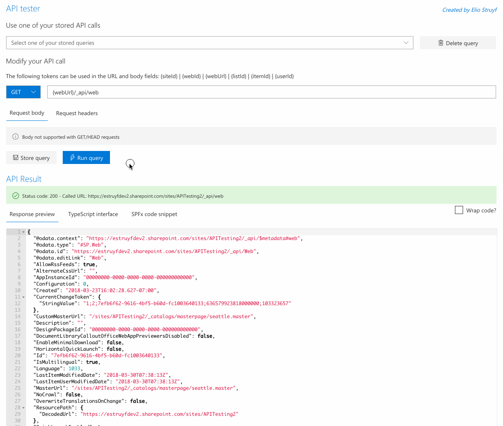
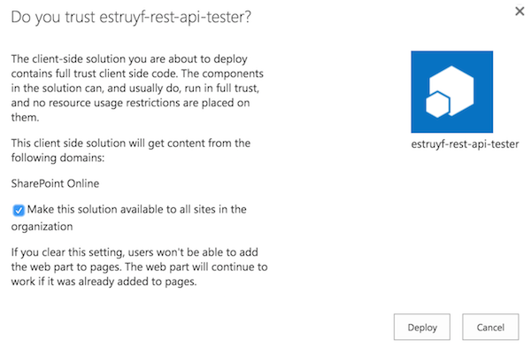
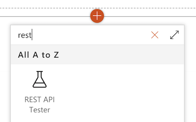

# SharePoint Framework - Rest API Tester

A web part that can be used for testing out SharePoint APIs without the hassle of using another application and configuring the right headers.



## Features

The web part has the following built-in features:

- Stores the last used query in local browser storage.
- Ability to store your favorite queries (currently stored in local storage as well).
- Ability to use tokens in the API URL. These are coming from the `this.context.pageContext` object from SPFx.
- API URL Suggestions
- Allows you to set custom headers and body. The body disabled for GET and HEAD requests.
- For every request you get the JSON response.
- Automated conversion of the JSON response to a TypeScript interface.
- SPFx code snippet for the performed query.

## Ready to use this web part?

To make it easier, I have created an automated release process to this repository so that you do not have to clone the repository / bundle / package the solution. The latest version will always be available here: [all releases](https://github.com/estruyf/spfx-rest-api-tester/releases).

> **Info**: automated release process is achieved with VSTS and an Azure Function.

To install it to your tenant, you have to follow the next steps:
- Download the `estruyf-rest-api-tester.sppkg` package from a release
- Upload the solution package to your tenant/site-collection app catalog
- Trust the solution to be available in your environment



- Create a page, and add the web part on it



## Changelog

For the latest changes, please check out the [changelog](./CHANGELOG.md).

> **Info**: changelog is driven by the [changelog.json](./changelog.json) file. This file will also be used during the automated release process to insert the right information for the release.

## Want to contribute?

Contributions are more than welcome! Please target your PRs to the `DEV` branch. 

A great way to contribute is to enrich the known APIs file. This file is used for the API URL suggestions. The structure of this file looks like this:

```JSON
{
  "api": [
    { "method": "<METHOD-TYPE>", "url": "_api/..." }
  ]
}
```

The file is located here: [./src/webparts/restTester/components/known-apis.json](./src/webparts/restTester/components/known-apis.json).

## Minimal path to awesome / running your own development version

So you want to run your own version of the web part. Great! Here is what you have to do:

- Clone this repository
- Install the project dependencies: `npm i`
- Start running the local version: `gulp serve`
- Start testing out the web part

## Ideas / feedback / issues

Got ideas, feedback, or discovered a bug / issue? Please add these via an issue to the issue list of this repository: [issue list](https://github.com/estruyf/spfx-rest-api-tester/issues).
